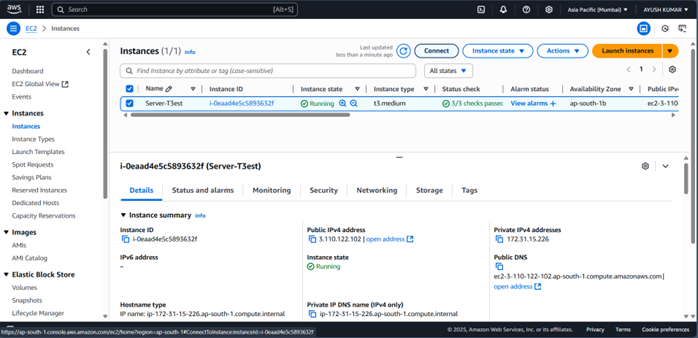
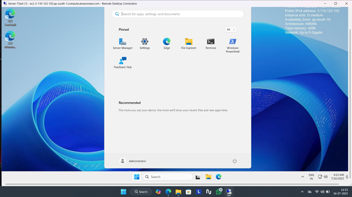

# 🚀 Launching a Windows EC2 Instance on AWS

This project provides a complete step-by-step guide to launching and accessing a **Windows-based EC2 (Elastic Compute Cloud) instance** on Amazon Web Services (AWS). It demonstrates the creation, configuration, and connection to a Windows Server using **Remote Desktop Protocol (RDP)**.

---

## 📌 Objective

To deploy a Windows EC2 instance using AWS and learn how to:
- Configure instance settings
- Access the server using RDP
- Perform real-world use cases (web hosting, development, file sharing, etc.)
- Terminate the instance safely after use

---

## 🛠️ Tools & Services Used

- **Amazon EC2**
- **Amazon VPC (Virtual Private Cloud)**
- **RDP Client (Remote Desktop Connection)**
- **Windows Server 2019 Base AMI**
- **Key Pair (.pem file)**

---

## 📘 Step-by-Step Guide

### 1. Log in to AWS Console  
➡️ Go to [AWS Management Console](https://aws.amazon.com/console/) and log in.

### 2. Open EC2 Dashboard  
➡️ Navigate to `EC2` from the Services menu.

### 3. Launch Instance  
➡️ Click on **Launch Instance** to start a new Windows VM.

### 4. Name Your Instance  
➡️ Provide a name like `"Windows-Test-Instance"`.

### 5. Choose Amazon Machine Image (AMI)  
➡️ Select a Windows-based AMI, e.g., `Microsoft Windows Server 2019 Base`.

### 6. Choose Instance Type  
➡️ Select `t2.micro` (Free Tier eligible).

### 7. Create or Select Key Pair  
➡️ Generate or select a key pair for secure SSH/RDP access.  
➡️ Download the `.pem` file safely.

### 8. Configure Network Settings  
➡️ Choose default VPC/subnet or custom.  
➡️ Ensure **port 3389 (RDP)** is allowed in the security group.

### 9. Configure Storage  
➡️ Set root volume to e.g., `30 GiB` (General Purpose SSD).

### 10. Review and Launch  
➡️ Confirm settings and click **Launch Instance**.

### 11. Monitor Instance State  
➡️ Wait for the instance to reach **"running"** and pass **status checks**.

### 12. Connect via RDP  
➡️ Click `Connect` → Choose `RDP client`.  
➡️ Download `.rdp` file.

### 13. Decrypt Password  
➡️ Upload your `.pem` file to decrypt the **Administrator** password.

### 14. Access Windows Server  
➡️ Open the `.rdp` file, enter decrypted password.

✅ **Your Windows EC2 Instance is now live!**

---

## 🧠 Use Cases

- 💼 Hosting websites using IIS
- 🧪 Development/testing environment for .NET, Java, etc.
- 📂 File sharing via Remote Desktop
- 🖥️ Remote Windows workstation
- 🔐 Installing SQL Server, Visual Studio, etc.
- 🗃️ Database hosting (MS SQL/MySQL)
- 🔄 Automating scripts via Task Scheduler or PowerShell
- 🧷 Active Directory/Domain integration

---

## 🧹 Terminate the Instance (Important!)

To avoid charges:

1. Go to the EC2 dashboard  
2. Select the instance  
3. Click **Instance State → Terminate Instance**  
4. Confirm termination

⚠️ *Note: This action is irreversible unless an AMI or snapshot is created beforehand.*

---

## 📷 Screenshots

---

## 📄 License

This project is for educational purposes. No license is applied.

---

## 🙌 Acknowledgments

Thanks to AWS Free Tier for providing resources to test and learn cloud computing.

---

